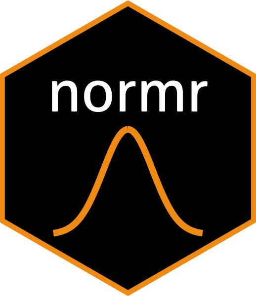

<!-- README.md is generated from README.Rmd. Please edit that file -->


# normr
> A package for analysing data related to norms.

[](https://shields.io/#/)
[](https://shields.io/#/)
[](https://shields.io/#/)
[](https://shields.io/#/)


normr stands for norm R package. 

The goal of normr is to facilitate data analysis and plot. 

The benefit of having the pkg includes: 

1. reducing amount of codes and prone errors 

2. collaborative data analysis - make sure everyone is on the same page


## Installation

Install the latest development version (on Github) via devtools:

```sh
devtools::install_github("jinyi-kuang/normr")
```


## Authors

- [Jinyi Kuang](https://www.jinyikuang.com) – jinyikuang1@gmail.com


## License

See ``LICENSE`` for more information.


## Contributing

Contributions are always welcome!

Please follow the following steps:
1. Fork it (<https://github.com/jinyi-kuang/normr/fork>)
2. Create your feature branch (`git checkout -b feature/fooBar`)
3. Commit your changes (`git commit -am 'Add some fooBar'`)
4. Push to the branch (`git push origin feature/fooBar`)
5. Create a new Pull Request


